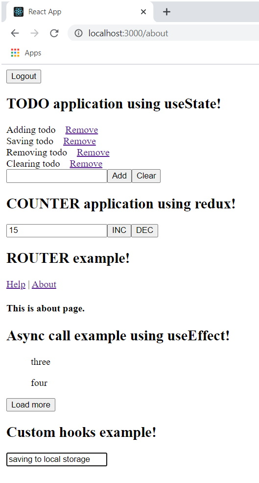

# react-redux
The idea here is to setup a very basic react application for absolute beginners. It also covers a very basic implementation for redux. Although the tasks are really small but they are important means to demonstrate how these technologies work. The project covers the followings  

  1. React - useState, useEffect, useRef, router, etc.
  2. Redux - Store, Reducers, Actions, Dispatch. 

